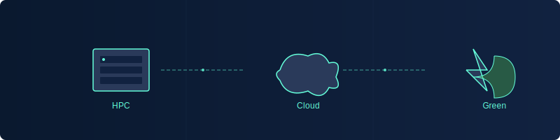

# Hi there 👋, I'm Pau Santana

## 🚀 About Me

I'm a **DevOps Engineer & HPC Systems Administrator** with a passion for Linux, AI, and High-Performance Computing. I'm dedicated to bridging the gap between traditional HPC environments and modern DevOps practices to accelerate scientific discovery while minimizing environmental impact.

Based in Sweden, I thrive on challenges that combine technical expertise with innovative thinking, particularly in areas where computing power meets sustainability goals.

## 💻 Skills & Technologies

  
  
  
  
  
  
  
  
  
  
  
  
  

## 🌱 Current Focus

- 🐧 **Linux**: Deep expertise in Linux systems administration and optimization for high-performance environments
- 🧠 **Artificial Intelligence**: Implementing AI solutions and infrastructure to support machine learning workloads
- 🌿 **HPC**: Designing and implementing high-performance computing infrastructures for scientific research
- 🔄 **Automation**: Creating comprehensive automation pipelines for scientific environments using Ansible, AWX, and Terraform
- 🔍 **Monitoring**: Developing advanced monitoring solutions with Prometheus and Grafana to optimize resource usage

## 📊 GitHub Stats

  
  

## 📝 Recent Blog Posts

<!-- MEDIUM-BLOG-POST-LIST:START -->- [Guide: Running RTMP + HLS with Docker and FFmpeg](https://medium.com/@psantana5_/guide-running-rtmp-hls-with-docker-and-ffmpeg-769c3f14462e?source=rss-d53a7a8dd318------2)- [Automating HPC Cluster Deployments with Ansible: A Modular, Scalable Approach](https://medium.com/@psantana5_/automating-hpc-cluster-deployments-with-ansible-a-modular-scalable-approach-0712bb97a19a?source=rss-d53a7a8dd318------2)- [Two Handy Bash Scripts for Linux Admins &amp; DevOps Engineers — Plus a Bonus at the End!](https://medium.com/@psantana5_/two-handy-bash-scripts-for-linux-admins-devops-engineers-plus-a-bonus-at-the-end-8b0ca301c485?source=rss-d53a7a8dd318------2)- [Understanding Docker: A Beginner’s Guide](https://medium.com/@psantana5_/understanding-docker-a-beginners-guide-527ca9e82afa?source=rss-d53a7a8dd318------2)- [The Linux distros madness…what distro should I pick?](https://medium.com/@psantana5_/the-linux-distros-madness-what-distro-should-i-pick-3b37330e4bef?source=rss-d53a7a8dd318------2)<!-- MEDIUM-BLOG-POST-LIST:END -->

## 💼 Key Projects

<!-- DYNAMIC_REPOS_START -->
- [**ansible-hpc**](https://github.com/psantana5/ansible-hpc) - Set of Ansible playbooks for deploying and managing a High-Performance Computing (HPC) cluster for Rocky 8-9 hosts. Final project at LinkiaFP for Pau Santana.
- [**bash-scripts**](https://github.com/psantana5/bash-scripts) -  Welcome to my Bash Playground Repository! 💻  Explore a collection of powerful scripts I've crafted to deploy, configure, and remove various services like DNS, FTP, Email, and Web Servers. Dive into the world of Bash scripting and unleash the true potential of automation. Join me on this exhilarating quest for mastery! ⚡️
- [**firewall**](https://github.com/psantana5/firewall) - 🔥🔒 Small Firewall Project 🌐🛡️  The firewall project is a network security application implemented in C++. 
<!-- DYNAMIC_REPOS_END -->

## 📫 Connect With Me

  
  
  

## ⚡ Fun Facts

- 🖥️ Built my first HPC cluster at 18
- 🌍 Passionate about how computing can accelerate scientific discovery
- 🔋 I can talk for hours about linux optimization

---

  
  
💡 <i>"The most sustainable byte is the one you don't compute."</i>

